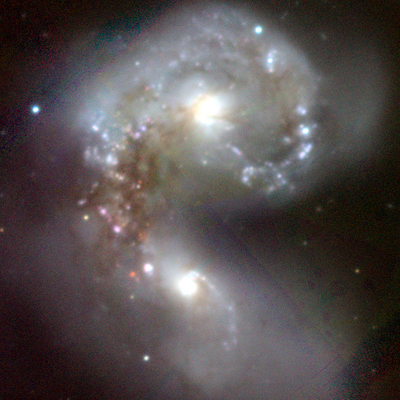

# How to work with images

``` r
library(panstarrs)
library(magick)
#> Linking to ImageMagick 6.9.12.93
#> Enabled features: cairo, fontconfig, freetype, heic, lcms, pango, raw, rsvg, webp
#> Disabled features: fftw, ghostscript, x11
```

## Example 1

### Plot color image of the Antennae galaxies

``` r
coords_antennae <- ps1_mast_resolve('Antennae')

ps1_image_color(
  coords_antennae$ra, 
  coords_antennae$dec, 
  format = 'png', 
  size = 600
) |> 
  magick::image_read() |> 
  magick::image_resize("400x400")
```


